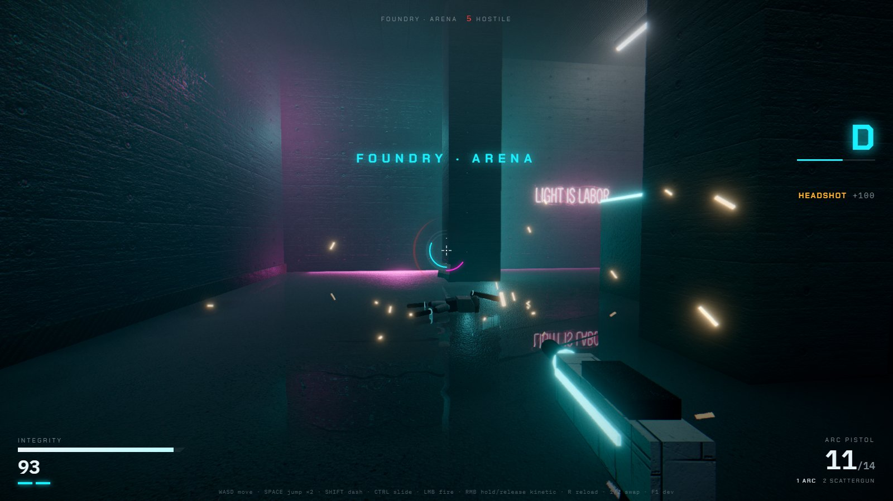
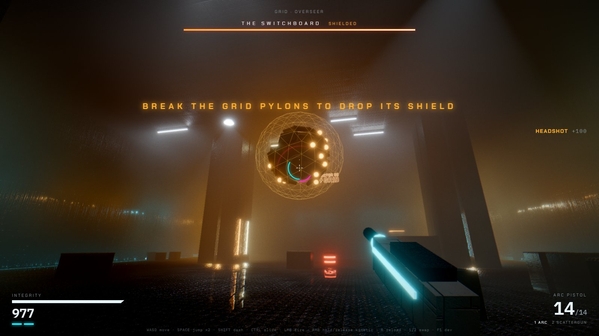
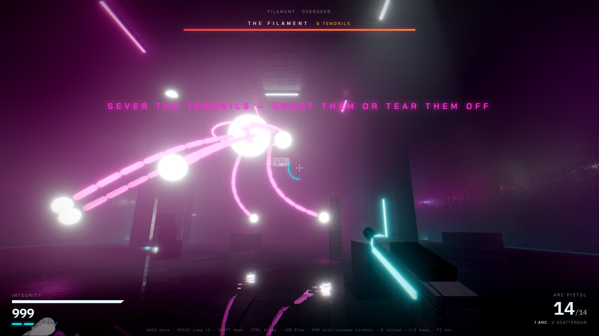
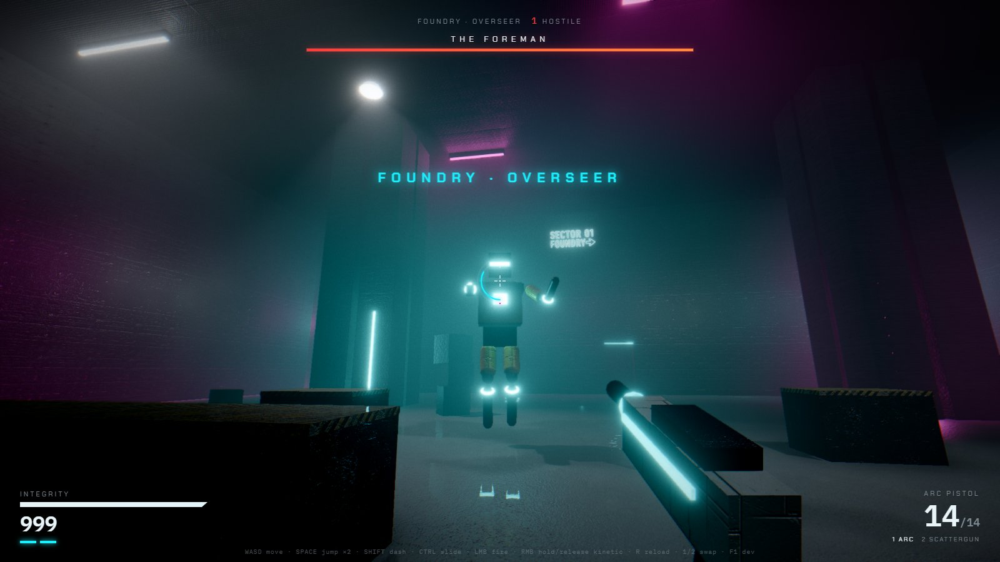
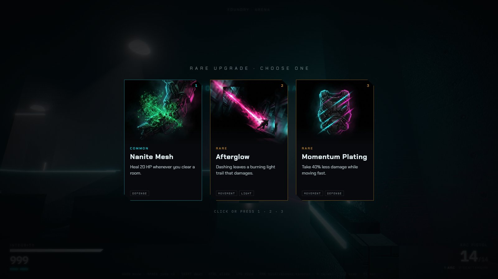
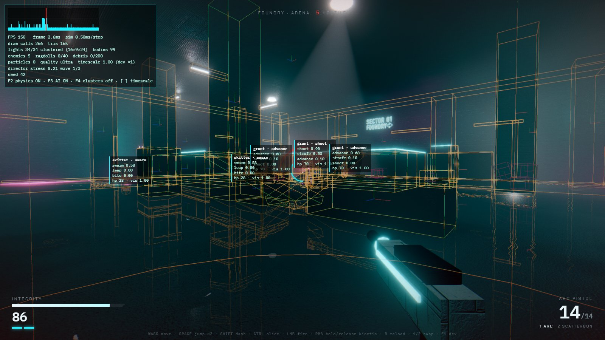
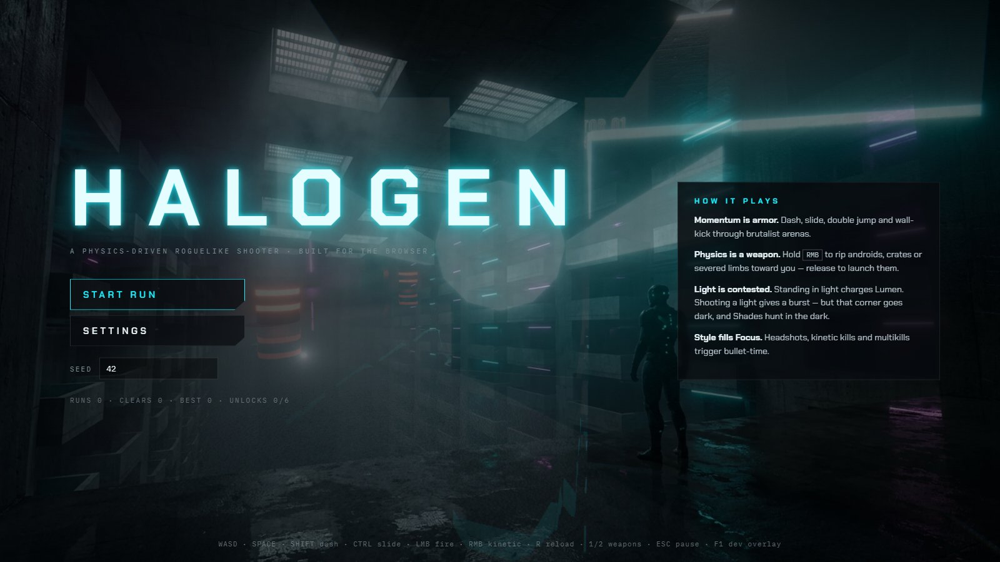

# HALOGEN

**A physics-driven, neon-brutalist roguelike FPS that runs in your browser.**
Dash through a dead arcology, rip androids off the floor with a kinetic hand, throw them through
concrete, and fight over the light itself.



| | |
|---|---|
|  |  |
|  |  |
|  |  |

## Play

**Live build: <https://caldedaniele.github.io/halogen/>** (desktop, keyboard + mouse; `?seed=123` works there too).

```bash
npm install
npm run dev          # http://localhost:5173
```

Desktop Chrome / Edge / Firefox, keyboard + mouse. `npm run build` produces a static `dist/` you can host anywhere.

| Input | Action |
|---|---|
| `WASD` | move (bhop-style air strafing works) |
| `Space` | jump · double jump · wall-kick |
| `Shift` | dash (2 charges, brief i-frames) |
| `Ctrl` | slide (keeps momentum, accelerates down ramps) |
| `LMB` | fire (Rail Lance: hold to charge) |
| `RMB` hold / release | kinetic hand: grab / launch |
| `R` · `1` `2` · wheel | reload · swap weapon |
| `Esc` | pause (route map, settings) |
| `F1` | dev overlay (`F2` physics, `F3` AI, `F4` light clusters, `[` `]` timescale) |

URL flags: `?seed=123` shares a run · `?bench` runs the worst-case perf harness.

## Design

Three pillars, each backed by a system:

1. **Momentum is armor.** Quake-lineage movement on a character controller: ground/air acceleration split,
   coyote time, jump buffering, dash charges with i-frames, slides that keep speed, wall-kicks.
   Cards like *Meteor*, *Phase Dash* and *Afterglow* turn movement into offense.
2. **Physics is a weapon.** Every android is an articulated rigid-body skeleton. The kinetic hand grabs anything
   dynamic (androids alive or dead, crates, debris, severed limbs, boss tendrils). Impact damage comes
   from kinetic energy at contact. Rail shots pin corpses to walls.
3. **Light is contested.** Standing in light charges **Lumen** (it powers the kinetic hand). Shooting a fixture
   gives a burst of it, but that zone goes dark. *Shades* are invisible and can't be hit in darkness.
   *Lamplighter* drones fly to broken lights and repair them. Every enemy attack is telegraphed by its
   emissive core flaring.

A run is 3 sectors × a branching 6-layer route (Slay the Spire style). Each exit door shows the room type
and reward behind it. Clearing a room offers 1 of 3 cards (45 cards, tag-weighted for synergies). Sector
bosses:

- **The Foreman**: a 5 m android. Shooting its arms off severs them and advances its phases. Jump over its
  ground shockwaves.
- **The Switchboard**: shielded while any of the four grid pylons is lit. Black out the room to open a
  9-second overload window.
- **The Filament**: a core of light held up by six physical tendrils. Shoot the tendrils off, or grab one
  and *tear* it out with the kinetic hand. When it dies, every light in the arcology goes out.

Meta-progression is unlocks only (6 cards earned across runs), no stat grind.

**Difficulty curve.** The director spends a point budget per room (grunt 2, skitter 1, shade/lamplighter 3,
charger 4): `10 + 2·depth + 7·sector`, ×1.5 in elite rooms, so the opening room is a 10-point warm-up and a
late sector-3 elite tops out at 51 (it was 61 before the first playtest). Waves release as the field thins
out and are held back 3–7 s while the player is under stress. Every attack has a wind-up tell (0.35–0.65 s)
and enemy bolts are slow enough to strafe. Tuning after playtest feedback ("too hard", "Skitters are hard
to hit") lowered enemy damage by 20–30%, slowed Skitters and gave them a forgiving hurtbox. A standing
player now survives about 5.7 s against nine mixed enemies spawned in a ring (4.6 s before). Unit tests
pin the budget curve ([`director.test.ts`](tests/director.test.ts)).

## Engineering highlights

**Clustered forward lighting.** Three.js's standard forward renderer tops out around a dozen lights.
HALOGEN splits the frustum into 16×9×24 clusters and bins up to **128 dynamic lights** per frame on the CPU
([`clustered.ts`](src/render/clustered.ts), unit-tested). The bins are uploaded as float textures and
injected into `MeshStandardMaterial` through `onBeforeCompile` ([`lights.ts`](src/render/lights.ts)). Every
muzzle flash, tracer, explosion, enemy core, dash trail and neon tube is a real light. Neon tubes are
*tube lights*: the representative point blends between the closest point to the reflection ray and to
the surface, so specular highlights stretch correctly on wet floors.

**Volumetrics that reuse the clusters.** A half-res raymarch ([`volumetric.ts`](src/render/volumetric.ts))
looks up the light cluster for each sample's depth and integrates only those lights. It adds
Henyey-Greenstein scattering, drifting 3D-noise dust, blue-noise jitter and a soft-clip so explosions
don't white out the haze.

**Wet-floor SSR without a G-buffer.** [`ssr.ts`](src/render/ssr.ts) reconstructs normals from depth, keeps only
upward-facing pixels, masks puddles with world-space FBM, then raymarches with binary refinement and
Fresnel.

**Articulated androids.** One data-driven builder ([`ragdoll.ts`](src/physics/ragdoll.ts),
[`defs.ts`](src/game/enemies/defs.ts)) makes bipeds, quadrupeds and drones.

- **Alive:** segments are kinematic, driven by forward kinematics from procedural animation: two-bone IK
  foot planting from a stance/swing gait, arm aim IK, head look, lean.
- **Hit:** spring-driven flinch on the struck chain.
- **Stagger / death:** bodies switch to dynamic and pre-built revolute/spherical joints take over.
- **Recovery:** the ragdoll blends back to the animated pose over 0.45 s, a "reboot" with flickering
  emissives.
- **Dismemberment:** a joint is removed, and the subtree becomes a free, grabbable physics object.

**Kinetic hand.** A mass-aware spring-damper with force limiting, so heavy things lag and swing.
Throws aim-assist toward the crosshair, and impact damage is read from Rapier contact-force events
([`kinetic.ts`](src/game/player/kinetic.ts)).

**Destruction.** Seeded recursive box fracture that conserves volume and is deterministic (unit-tested).
Chunks run in a capped debris budget and stop colliding with each other after 2 s to keep the solver cheap.

**AI and pacing.** Utility scoring at 5 Hz feeds small per-type state machines: cover, flank, strafe,
rush-into-wall stuns, leaps, shades seeking darkness, drones repairing lights and shielding allies.
A Left-4-Dead-style director meters waves by player stress. A* runs on the generated room grid.

**Procedural audio.** Every sound effect is synthesized at play time from layered WebAudio recipes
(transient + body + tail, randomized per play, [`synth.ts`](src/audio/synth.ts)). Spatialization is HRTF
with a generated convolution reverb sized to the room. Bullet-time lowpasses and downshifts the whole mix.

**Game feel.** A fixed 120 Hz simulation with interpolated rendering. Bullet-time scales simulation dt,
never mouse look. Also: hit-stop, trauma-based shake, FOV kicks, recoil springs (sub-stepped so a
throttled tab can't explode them), impact frames, and a style meter that rewards variety. Every hit
confirms on four channels at once: a popping hitmarker, a layered confirm sound weighted by damage, a
white flash + scale punch + flinch on the struck part, and a floating damage number that merges rapid
hits per enemy (HP bars appear over anything you've damaged; both can be turned off in Settings). The
kinetic hand *yanks* on grab (hit-stop, sparks), throws with a 10° aim assist that leads moving targets,
and a connecting throw slams: 70 ms hit-stop, flash, and a 2.6 m shove that staggers bystanders.

**Procedural levels.** A seeded grid generator ([`generator.ts`](src/game/level/generator.ts)) builds arenas,
gauntlets, vertical shafts with ramped platforms, dark zones, sanctums and boss halls. It rejects any
layout where spawns or exits aren't reachable (tested across 40 seeds × 6 room types). The builder
merges static geometry per material, greedily merges colliders, and places breakable fixtures, props,
explosive barrels and neon signage.

## Assets

Everything visual that isn't geometry was generated for this project through OpenRouter:
**Gemini 3.1 Flash Image** for the 11 tileable materials, 45 card illustrations and neon signs;
**Gemini 3 Pro Image** for key art and boss portraits; **Lyria 3** for 12 music tracks.
Total spend: **$4.16**.

The pipeline ([`tools/gen-assets.mjs`](tools/gen-assets.mjs)) is manifest-driven, idempotent, tracks spend
and hard-stops at a budget. [`tools/texproc.mjs`](tools/texproc.mjs) makes albedos seamless (offset-blend)
and derives normal + roughness maps. Every asset has a procedural fallback, so a failed load never
breaks a run.

## Performance

| Scene | Result |
|---|---|
| Typical combat, Ultra, 1600×900 (headless Edge, GPU) | ~127 FPS, 3.4 ms/frame |
| **Worst case** `?bench`: 40 ragdolls, 200 debris, 128 lights, High, 1080p | p50 16.4 ms · p95 20.8 ms (incl. forced GPU sync) |

Quality tiers are Low / Medium / High / Ultra. A governor steps down a tier automatically if frames stay
above 21 ms for 4 s.

## Tests

```bash
npm test             # 131 unit tests (vitest): rng, loop, time, budget, events, input, clustering,
                     #   generator reachability, run map, cards/synergies/unlocks, fracture, defs, springs,
                     #   director budgets, damage-number merging, throw aim assist, hurtboxes
npm run test:e2e     # Playwright (system Edge): boots a seed, runs a scripted bot for 10 s of combat,
                     #   clears the room, asserts zero console errors; settings persistence; kinetic
                     #   throw assist; damage numbers/HP bars; Skitter hurtbox
BENCH=1 npx playwright test e2e/bench.spec.ts   # perf harness
SHOTS=1 npx playwright test e2e/shots.spec.ts   # regenerates the screenshots above
```

## Structure

```
src/core      fixed-step loop, timescale/hit-stop, seeded RNG, typed events, input, budgets
src/render    renderer + post stack, clustered lights, volumetrics, SSR, materials, particles, decals
src/physics   Rapier world, articulated bodies, fracture
src/audio     procedural SFX synth, music director
src/game      player (movement, camera juice, weapons, kinetic), enemies (android, AI, director, bosses),
              level (generator, builder, fixtures, props, nav grid, run map), run (state, cards)
src/ui        HUD, card picker, menus, dev overlay
tools         asset generation + texture processing
```

Built with TypeScript, Three.js, Rapier (WASM), pmndrs postprocessing, N8AO and Vite.
